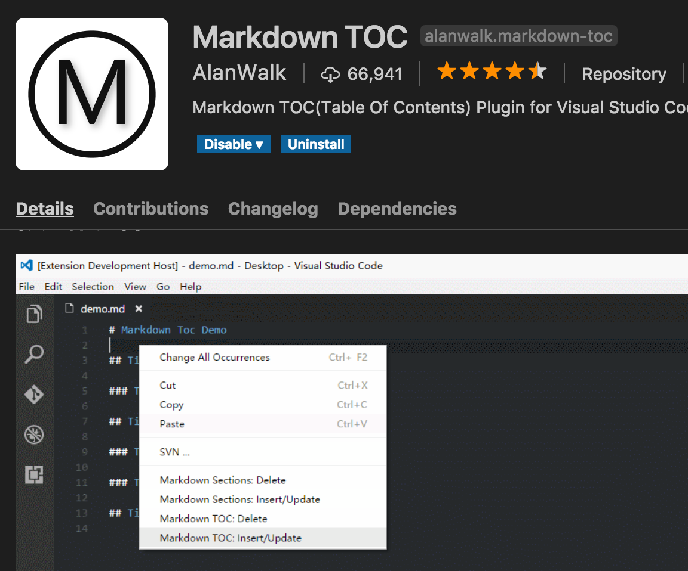

<!-- TOC -->

- [Guide for Contributor](#guide-for-contributor)
    - [Screenshot on MAC](#screenshot-on-mac)
    - [Heading levels](#heading-levels)
    - [Git commit message](#git-commit-message)
    - [File naming convention](#file-naming-convention)
    - [Table of Contents (TOC)](#table-of-contents-toc)
    - [Link whenever possible](#link-whenever-possible)
        - [Link to GitHub comments](#link-to-github-comments)

<!-- /TOC -->

--------

# Guide for Contributor

## Screenshot on MAC

By default, we prefer taking screenshot of proper sized window. Please check out "How to take a screenshot of a window" of [this post](https://support.apple.com/en-hk/HT201361).

## Heading levels

* `#` -- The main title of this page. It will show as `<h1>` in rendered format, or in the `<title>` of an HTML page's meta sections.
* `##` -- The first level of section heading.
* `###` -- The second level of section heading.

## Git commit message

Write a brief commit message so others can quickly comprehend the changes in this commit. If the commit message is complex, write a brief line within 70 characters and the remaining texts in the body after line break.

Bad example:


Good example:


## File naming convention

Adopt the [URL-slug](https://en.wikipedia.org/wiki/Clean_URL#Slug) convention:

* All lowercase. Exception can be made when part of the phrase is an acronym.
* Replace blanks by dash, i.e. `-`.
* Put informative phrases into the path, so that the content/ meaning of the file can be quickly comprehended from its path/ URL.
* Only use alphabets, numbers, dash and dot (for extension name).

The way to check if a file path is URL-friendly or not is straightforward. Just copy and paste this path into your browser's address bar and see if it is changed to another string. For example, a single blank will be changed to `%20` in the address bar. If it stays the same, we think it is URL-friendly.

Good example:

```text
git-commit-message-good.png
```

Bad example 1: (blanks are not URL friendly)

```text
git commit Message Good.png
```

Bad example 2: (not informative enough; may clash with other screenshots)

```text
git.png
```

Bad example 3: (not informative enough; may clash with other screenshots)

```text
commit.png
```

## Table of Contents (TOC)

In VSCode, install the following plugin and follow the menu to generate TOC for a markdown document.



The TOC generated by this plugin is automatically updated. Please do not touch the content in between

```markdown
<!-- TOC -->
... some listing here
<!-- TOC -->
```

To help our future development, e.g. render the openbook via a static site generator, please wrap the TOC by another layer of `<div id="toc">`. The whole TOC code block looks like this:

```markdown
<div id="toc">
<!-- TOC -->
... some listing here
<!-- TOC -->
</div>
```

## Link whenever possible

The beauty of Internet and one of its original design goal is to **connect everything**. URL/ URI provides a system for inter linking between documents. In our openbook, contributors try the best to link to relevant resources if those resources are public already. When making quote or taking screenshots, it is a convention to link to the original article/ interface.

For example, when explaining how the discussion forum works on GitHub, one do not only have screenshots but also can experience the live version. This [Git diff](https://github.com/hupili/python-for-data-and-media-communication-gitbook/commit/f5a246f1950c2a64496422dd8252080e745239a9#diff-1c07895b36976c761440cb56a1d15a76L108) demonstrates how and [here](https://github.com/hupili/python-for-data-and-media-communication-gitbook/blob/master/notes-week-00.md#use-github-issue-tracker-as-a-discussion-forum) is the rendered version.

### Link to GitHub comments

Click the date and get a full URL including the [URI fragment](https://en.wikipedia.org/wiki/Fragment_identifier). Read more on [Stack Overflow](https://stackoverflow.com/questions/25163598/how-do-i-reference-a-specific-issue-comment-on-github/25169132).