# Week 00 - Introduction and Preparation

<div id="toc">

<!-- TOC -->

- [Week 00 - Introduction and Preparation](#week-00---introduction-and-preparation)
    - [Foreword](#foreword)
        - [Course structure](#course-structure)
    - [Introduction & Objectives](#introduction--objectives)
    - [Getting-started on GitHub](#getting-started-on-github)
        - [Understand markdown](#understand-markdown)
            - [Headings](#headings)
            - [Listing](#listing)
            - [Emphasis](#emphasis)
            - [URL](#url)
            - [Image](#image)
            - [Inline code snippet](#inline-code-snippet)
            - [Code block & Syntax Highlighting](#code-block--syntax-highlighting)
            - [Quote](#quote)
        - [Use GitHub issue tracker as a discussion forum](#use-github-issue-tracker-as-a-discussion-forum)
        - [Learn other's code from commit history](#learn-others-code-from-commit-history)
        - [Preview a Jupyter notebook hosted on GitHub with Nbviewer](#preview-a-jupyter-notebook-hosted-on-github-with-nbviewer)
            - [Jupyter Notebook](#jupyter-notebook)
            - [Nbviewer](#nbviewer)
            - [Why do we need to preview Jupyter notebook on Nbviewer?](#why-do-we-need-to-preview-jupyter-notebook-on-nbviewer)
    - [GitHub Desktop](#github-desktop)
        - [Install GitHub Desktop](#install-github-desktop)
        - [Use GitHub Desktop to synchronize codes between local repository and GitHub hosted repository](#use-github-desktop-to-synchronize-codes-between-local-repository-and-github-hosted-repository)
            - [Create your first repository](#create-your-first-repository)
            - [Create a file in this repository](#create-a-file-in-this-repository)
            - [Publish your repository to GitHub](#publish-your-repository-to-github)
            - [Re-edit your file and synchronize codes between two ends](#re-edit-your-file-and-synchronize-codes-between-two-ends)
    - [GitHub Pages](#github-pages)
        - [Publish your first webpage on gh-pages](#publish-your-first-webpage-on-gh-pages)
            - [Step 1. Create a repository](#step-1-create-a-repository)
            - [Step 2. Clone the repository](#step-2-clone-the-repository)
            - [Step 3. Create an index file](#step-3-create-an-index-file)
            - [Step 4. Commit & publish](#step-4-commit--publish)
        - [Bonus: Add sub-path to your GitHub hosted domain](#bonus-add-sub-path-to-your-github-hosted-domain)
        - [Bonus: Bind a custom domain name](#bonus-bind-a-custom-domain-name)
            - [Step 1. Purchase domain](#step-1-purchase-domain)
            - [Step 2. Point domain name to GitHub](#step-2-point-domain-name-to-github)
            - [Step 3. Point GitHub repo to domain name](#step-3-point-github-repo-to-domain-name)
            - [The principle further explained](#the-principle-further-explained)
    - [Bonus: Collaboration on GitHub](#bonus-collaboration-on-github)
        - [The workflow Fork repo, modify code and send pull Request](#the-workflow-fork-repo-modify-code-and-send-pull-request)
            - [Fork repo](#fork-repo)
            - [Modify code](#modify-code)
            - [Pull Request](#pull-request)
    - [A first journey into the open source world](#a-first-journey-into-the-open-source-world)
        - [Common licenses](#common-licenses)
        - [Ethics and Code of conduct](#ethics-and-code-of-conduct)
    - [Exercises and Challenges](#exercises-and-challenges)
        - [Browse past student projects](#browse-past-student-projects)
        - [Raise a question](#raise-a-question)
        - [Participate in a discussion thread](#participate-in-a-discussion-thread)
        - [Bonus: conduct a survey of related reading materials on GitHub](#bonus-conduct-a-survey-of-related-reading-materials-on-github)
        - [Bonus: fork - modify - Pull Request (PR)](#bonus-fork---modify---pull-request-pr)
    - [References and further reading](#references-and-further-reading)

<!-- /TOC -->

</div>

## Foreword

The course COMM7780/JOUR7280 Big Data for Media and Communication is set up for master students in the school of communication, Hong Kong Baptist University. The purpose of this course is to motivate the students to become a [T-shape talent](http://www.caseinterview.com/t-shaped-skills) in communications field. The course involves intensive training of Python and quest in solving practical problems. This open book collects all the materials related with lab exercises covering Python basics, data scraping, table manipulation and data mining. Students also apply their duly learned knowledge to write data-driven reports on a regular basis.

The final projects of past students can be found in this archive GitHub organization: <https://github.com/data-projects-archive/>

This course is tailor made for communication background students and imposes no prerequisites. However, one need to get prepared to the following challenges:

1. Become a native GitHub resident -- join discussions, hand-in homeworks and collaborate projects, all on [GitHub](http://github.com/).
2. Expect intensive coding exercises in Python. Every class is about half lecture and half lab exercise. You will also have many exercises after the class.
3. Identify and solve practical problems in one's own domain, that can be tackled by a limited set of duly learned data analytics knowledge. Every week, one group will work on a real case using that week's knowledge.

### Course structure

Figure last updated: 20180803


Here is a brief map about what we are going to learn in the first semester. For more details, please refer to our [course outline](outline.md).

## Introduction & Objectives

This chapter covers "GitHub literacy" and walks the readers through the basic steps towards an open source learning experience. Following are the concrete objectives:

- Can use GitHub for resource hosting, project management and discussion forum.
- Can use GitHub Desktop to sync local repository with remote repository.
- Can use `gh-pages` to host static web pages as one's portfolio.

Chapter 0 is intended for anyone who wants to enroll in this course to study before the class. Besides learning GitHub, we also expect the readers to "tune in" our open book. You should feel conformable navigate around our Openbook, identify developed/ working-in-progress files, contribute ideas/ codes, and actively participate in the issue tracker. Note that sections marked **"Bonus:"** are optional materials. You can still follow the rest of the course without learning those sections.

## Getting-started on GitHub

You can sign up in [GitHub](https://github.com/). Pick a nice name, then you can start your wonderful journey conquering the galaxy of data and codes. There are many useful learning materials and meaningful projects on the platform waiting for you to open it, many interesting stories to discover.

### Understand markdown

> Markdown is a lightweight and easy-to-use syntax for styling all forms of writing on the GitHub platform.

-- Here is the explanation by GitHub.

Markdown is an easy-to-read and easy-to-write markup language. Computer programming language usually needs to be compiled or interpreted or rendered in order to get readable result from the source code. Markdown syntax is design in a way that makes it readable in both rendered (HTML) format or source code format. The conventional extension for a markdown file is `.md` and the content is just plain text.

As a beginner, one needs to master those syntax:

- Headings
- Listing, ordered or unordered
- Emphasis
- URL
- Image
- Inline code snippet
- Code block & Syntax Highlighting
- Quote

#### Headings

```md
# H1
## H2
###### H6
```

#### Listing

Unordered:

```md
* Item 1
* Item 2
  * Item 2a
  * Item 2b
```

Ordered:

```md
1. Item 1
2. Item 2
3. Item 3
   1. Item 3a
   2. Item 3b
```

#### Emphasis

```md
Strong emphasis, aka bold, with **asterisks** or __underscores__.
```

#### URL

```md
[text](link) For example： [GitHub](http://github.com)
```

#### Image

```md
 For example:

```

#### Inline code snippet

```md
`In line code here`
```

#### Code block & Syntax Highlighting

1. Use '```' in the beginning and end of the code to build the code block.
2. Add tag after the beginning '```' to highlighting the code, like python,text,md,javascript...

```md
    ```javascript
    var s = "JavaScript syntax highlighting";
    alert(s);
    ```

    ```python
    s = "Python syntax highlighting"
    print s
    ```

    ```
    No language indicated, so no syntax highlighting.
    But let's throw in a <b>tag</b>.
    ```
```

#### Quote

```text
> Quotes here.
```

Here are some readings to get you started with markdown:

- See the markdown source code of [the current chapter](https://raw.githubusercontent.com/hupili/python-for-data-and-media-communication-gitbook/master/notes-week-00.md) on GitHub.
- Go to the issue tracker (introduced in next section) and "edit" any message. See how markdown works in the discussion thread.
- The official document of [Mastering Markdown](https://guides.github.com/features/mastering-markdown/) from GitHub.
- Another good introduction of use of markdown [Markdown Syntax](https://github.com/younghz/Markdown) (in Chinese)

Bonus: Insert a internal link between different sections in different chapters

Example: I want to insert a link in chapter 2 `array` section which connect to one of the example of chapter 3.

```
[chapter 2](/notes-week-02.md#python-has-two-basic-modes-script-and-interactive
```

- `[chapter 2]` is the text you want to insert a link.
- `/notes-week-02.md` is the file path you want to connect to.
- `python-has-two-basic-modes-script-and-interactive` is the header of specific section you want to connect to. You can get this by lower all the letters of the header and connect them with `-`,and do not forget to use `#` ahead of the header.

### Use GitHub issue tracker as a discussion forum

The GitHub issue has a lot of features, but overall it looks like a lightweight collaboration system. Assignee or project manager can pull requests for new contributors and set a to-do list for contributors and teammates. You can use issue to ask questions, discuss with your team, label the `issue` you encounter, and collaborate with others, which greatly advances the managing of a Project. You can click [here](https://github.com/hupili/python-for-data-and-media-communication-gitbook/issues) to participate in the issues channel of our Gitbook to discuss with us. Feel free to leave your comments or questions so that we can help each other and learn from each other.

[Example 1](https://github.com/hupili/python-for-data-and-media-communication-gitbook/issues/2#issue-342975310): Set a to-do list for your teammates, once they finished the quest you pull, they can just tick to show the progress.

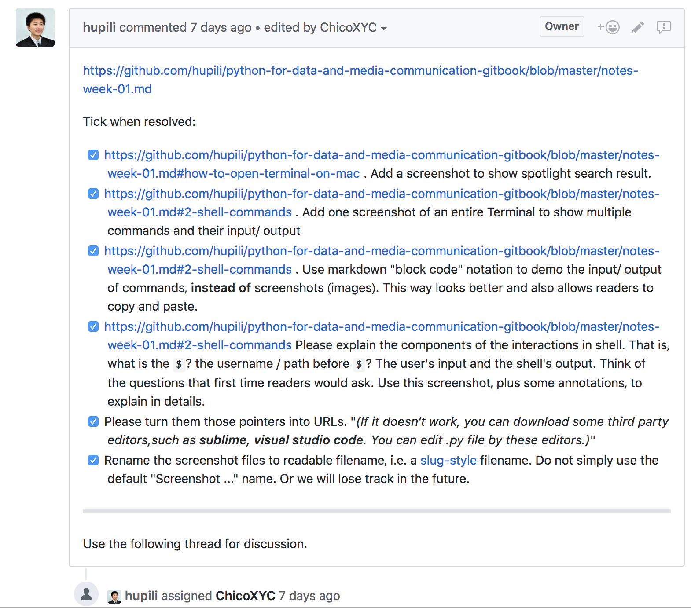  

[Example 2](https://github.com/hupili/python-for-data-and-media-communication-gitbook/issues/2#issuecomment-407719706): Discuss with your team members to track the working process.


### Learn other's code from commit history

  

You can see the latest update time and a brief summary of every piece of work in one's repository.  

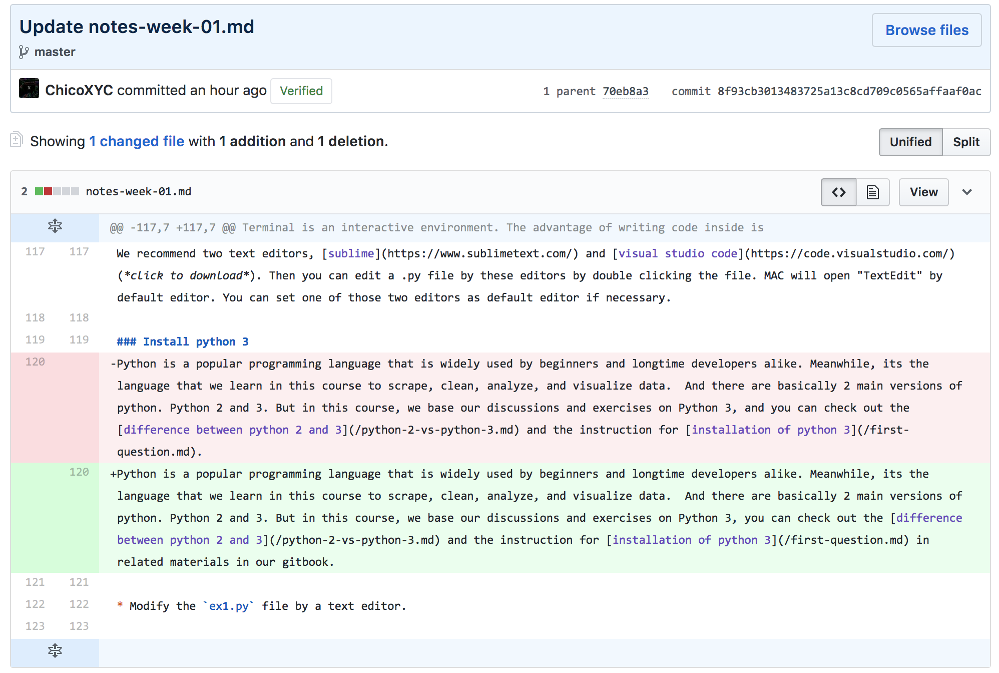

By clicking one of the files, and its commits, you can see the details of the improvements and changes they recently made, and you can learn from their work.

Red means deletion and green means addition. This notation makes it easy for you to track the difference and learn what others are doing.

### Preview a Jupyter notebook hosted on GitHub with Nbviewer

#### Jupyter Notebook

[Jupyter Notebook](http://jupyter.org/) is an open-source web application that allows you to create and share documents that contain live code, equations, visualizations and narrative text. In our course, Jupyter notebook will be our daily tool to write, test, and sharing our codes and works. It's very useful for us to learn and make **reproducible works**. The good advantage of jupyter notebook includes:

- The Notebook has support for over 40 programming languages, including Python, R, Julia, and Scala.
- Notebooks can be shared with others using email, Dropbox, GitHub and the Jupyter Notebook Viewer.
- Your code can produce rich, interactive output: HTML, images, videos, LaTeX, and custom MIME types.

You can check out our [tutorial](/module-jupyter.md) for how to install Jupyter environment and use Jupyter notebook, though, it's still in improvement stage.

#### Nbviewer

[Nbviewer](http://nbviewer.jupyter.org/) creates a simple way to view and share Jupyter Notebooks. You just need to copy the link of one Jupyter notebook and paste in Nbviewer. Click [here](https://github.com/jupyter/nbviewer) to know more about Nbviwer,to see what formats they support to present notebooks to the user.  
Here is an example, you can find one Jupyter notebook from github, and copy the link, paste into the Nbviwer.
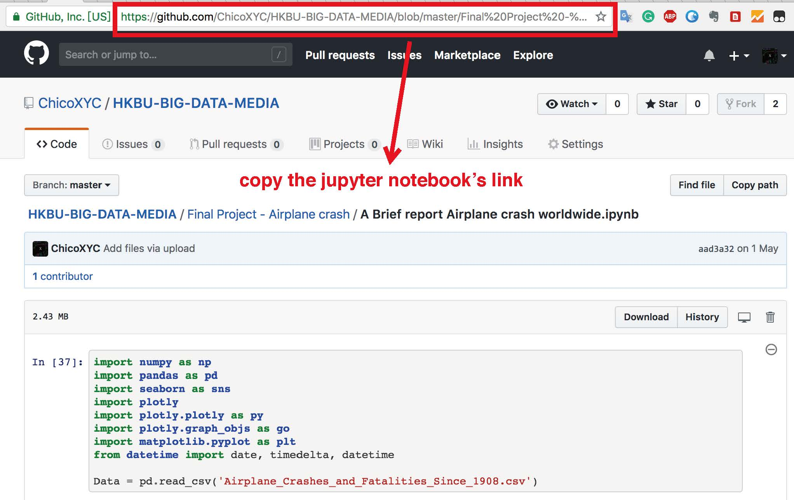

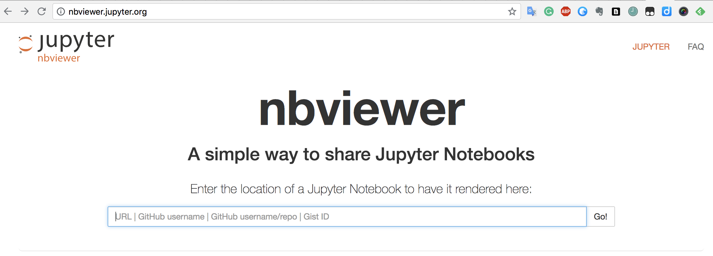

#### Why do we need to preview Jupyter notebook on Nbviewer?

Usually, we can directly preview a Python notebook on GitHub. However, GitHub prohibits Javascript execution for security reasons. If you have interactive chart, e.g. `echart`, `plotly`, those will not render on GitHub. Nbviewer supports javascript and it is the first free online tool to preview Python notebook, so we recommend it. For concrete examples of dynamic charts, here is an [example](http://nbviewer.jupyter.org/github/data-projects-archive/201804-Air-Crash/blob/master/Final%20Project%20-%20Airplane%20crash/A%20Brief%20report%20Airplane%20crash%20worldwide.ipynb) from students' last year. The last interactive map *flight path* can not be shown directly in GitHub, that's why we need Nbviewer.

## GitHub Desktop

### Install GitHub Desktop

You can download from [here](https://desktop.github.com/), and install it like you installed other apps before.

### Use GitHub Desktop to synchronize codes between local repository and GitHub hosted repository

Talking about this function, GitHub is like a cloud disk, which is similar to Google Drive, OneDrive. You can synchronize your codes and files between local and GitHub website. It's useful not just others can see your recent updates, but also improve the efficiency during the collaboration with others. If one of your teammates commit changes, you can synchronize by GitHub desktop and keep the same stage with them.

#### Create your first repository


After you log in GitHub desktop, click `create new repository`, give a name you like and choose the local path you want(but keep in mind where they are).

#### Create a file in this repository

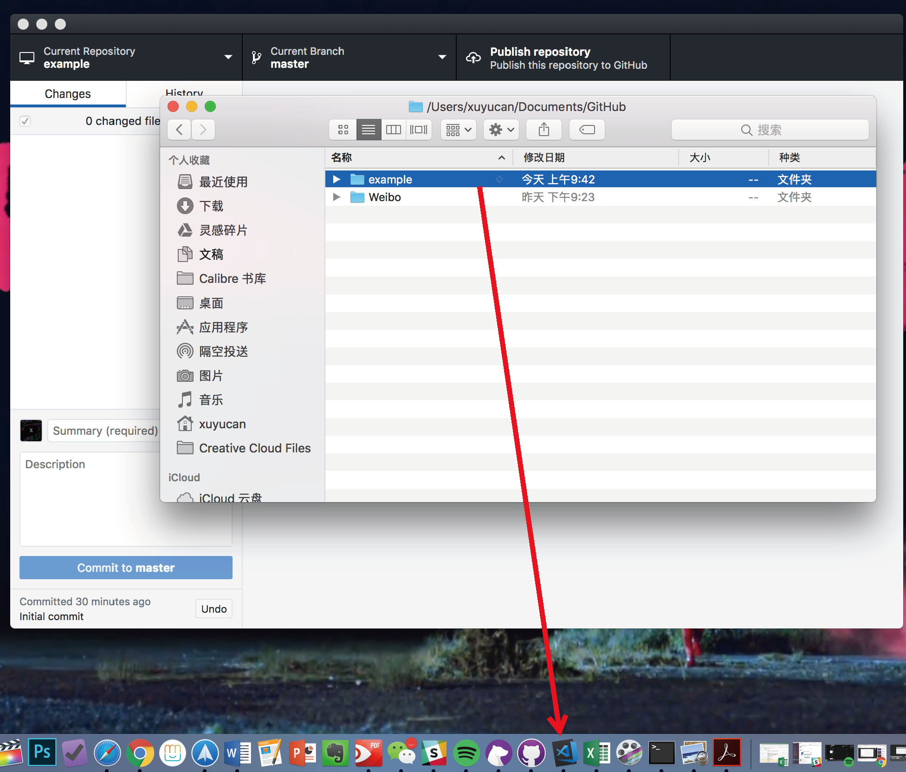
Find the repository/folder you just created, you can click `open this repository in finder` to know its file path. After you find the folder, drag the repository/folder into the text editor, in this case, I use *visual studio code*.

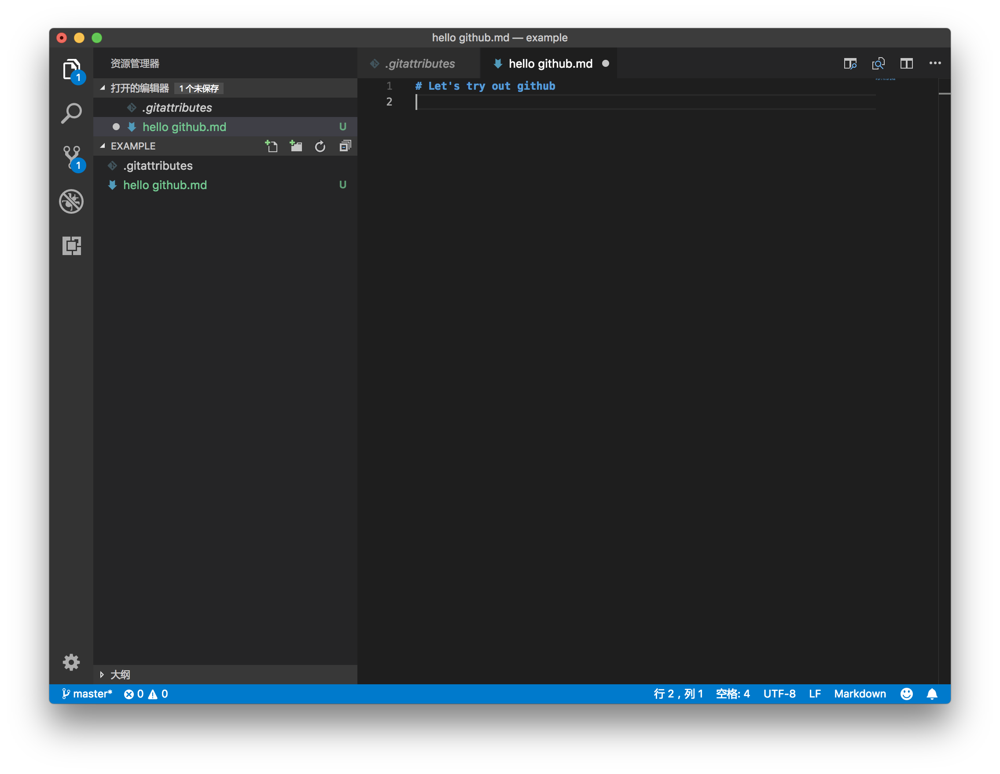
Under the example repository, create your first file `hello github.md`, write an H1 line `Let's try out github`, and save it.

#### Publish your repository to GitHub

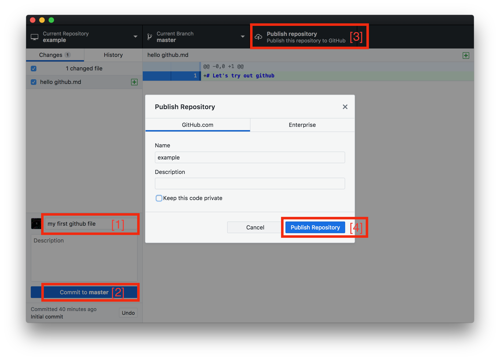
After creating your first file, open GitHub desktop, you can see the changes you did before. Give a description of this changes in [1], then commit to master in [2],(this step is like that you confirm the changes). After that, you can click [3] and [4] to publish your repo.


Open the GitHub website, find your new repo, click the repo and check out the files in this repo, whether it keeps the same pace with your local file.

#### Re-edit your file and synchronize codes between two ends

You can re-edited the files and codes both in GitHub website and in local text editor.

- If you edit in the website, after you save the file, click the `fetch origin`. Then the change you commit in the website will synchronize into your local repo.

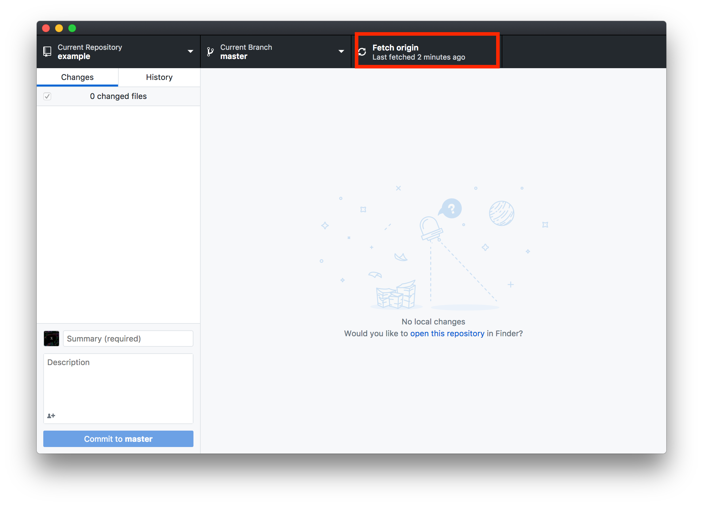

- If you edit in a local text editor, it's pretty much the same. You give a description, commit to mater, and then `fetch origin`. Then the change you commit in a local repo will synchronize into your GitHub site.

## GitHub Pages

GitHub Pages are websites for you and your projects. It helps you turn your GitHub repository into elegant websites to showcase your portfolio, your projects, documentation or anything you want to share with the world. There are no need to set up the database and configure servers. It's the most direct path to create websites for you and your projects. You can visit [GitHub Pages](https://pages.github.com/) to learn more.

### Publish your first webpage on gh-pages

#### Step 1. Create a repository

Head over to GitHub and create a new repository named `username.github.io`, where username is your username on GitHub.  

*Note: If the first part of the repository doesn’t exactly match your username, it won’t work, so make sure to get it right.*

#### Step 2. Clone the repository

There are basically two ways to clone the repository. Use terminal with codes or GitHub desktop. Since we just talk about the GitHub desktop. So we use this way to check out whether we are already familiar with it.

Click the "Set up in Desktop" button. When the GitHub desktop app opens, save the project.


#### Step 3. Create an index file

Basically, index.html is the default file served by the web server. So it is equivalent to visit example.com and example.com/index.html. Naming your file as index.html can lead to this more concise notation in browser's address bar and in communication campaigns -- the naming in the world of web is usually the shorter the better. More explanations are [here](https://en.wikipedia.org/wiki/Webserver_directory_index).

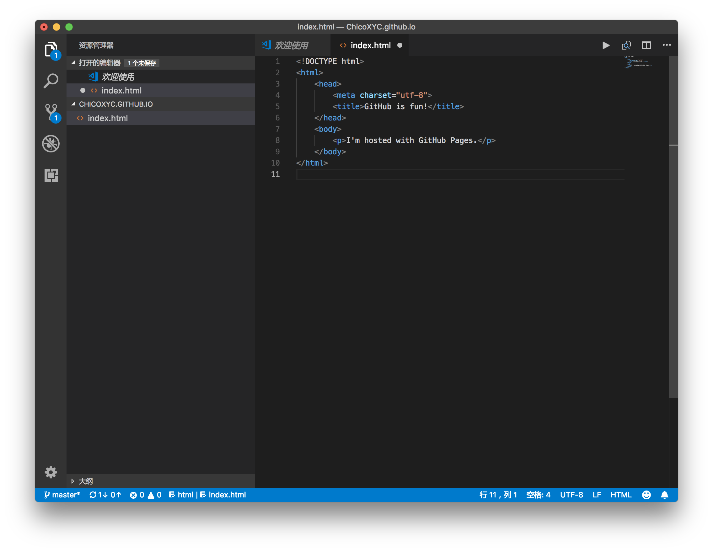

Grab your favorite text editor and add an index.html file to your project. You can copy this example in your html.

```html
<!DOCTYPE html>
<html>
    <head>
        <meta charset="utf-8">
        <title>GitHub is fun!</title>
    </head>
    <body>
        <p>I'm hosted with GitHub Pages.</p>
    </body>
</html>
```

#### Step 4. Commit & publish

Change to your GitHub desktop, commit your changes, and press the publish/push button.
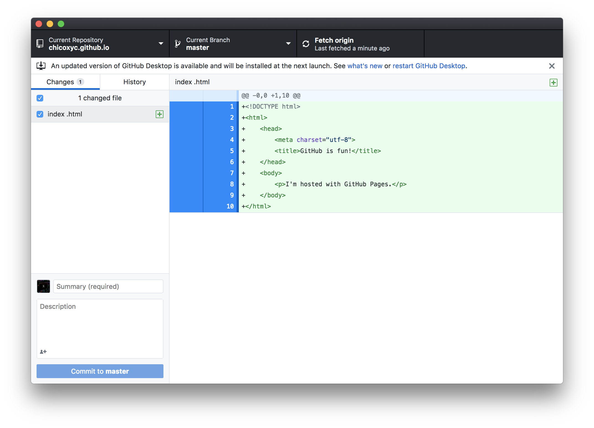

Then you can go to your webpage with `https://username.github.io`. Change username to yours and see what is happening. During further study, you will use GitHub pages to do more, to share and show anything you want with the world. For example, you can put your own CV, your portfolio, your essay of learning Python etc into html. For example, I build a simple introduction/CV for myself, you can check out here: https://chicoxyc.github.io/ .

### Bonus: Add sub-path to your GitHub hosted domain

By default, every user gets a secondary domain name at `username.github.io` where `username` is your GitHub username and `username.github.io` is also the repo name. It is of practical interest to add a sub-path to your domain for many reasons:

1. Test
2. Hand-in homework
3. Work on projects

Suppose you already have everything in a local folder called `homework1`. There are two ways to publish this folder at the URL `https://username.github.io/homework1`:

1. Host via the main repo:
   - Upload `homework1` to the root of repo `username.github.io` directly.
2. Host via a separate repo:
   - Create a new repo called `homework1`;
   - Create a branch called `gh-pages`;
   - Sync (upload) the content of your local folder `homework1` to the repo `homework1` on the branch `gh-pages`.

We recommend the first way to host basic materials about yourself and the second way to host projects. The second way exercises the principle of [Separation of Concerns](https://en.wikipedia.org/wiki/Separation_of_concerns).

In short, if your username is `XXX`, then the following repositories will be hosted as web sites on corresponding paths:


Here is one way you can create a new branch on GitHub web UI:


**NOTE**: The content is served from `gh-pages` branch by default. You can [change this default settting](https://github.com/hupili/python-for-data-and-media-communication-gitbook/issues/23).

### Bonus: Bind a custom domain name

See it in action first:

- The live website: http://datavis.studio/
- The GitHub repo: https://github.com/hkbu-jour2106/hkbu-jour2106.github.io

#### Step 1. Purchase domain


#### Step 2. Point domain name to GitHub

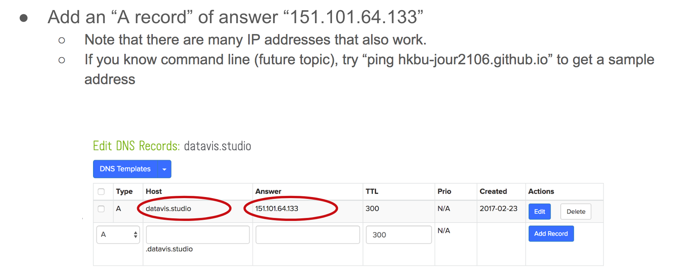

#### Step 3. Point GitHub repo to domain name


Checkout the working [CNAME](https://github.com/hkbu-jour2106/hkbu-jour2106.github.io/blob/master/CNAME)

#### The principle further explained

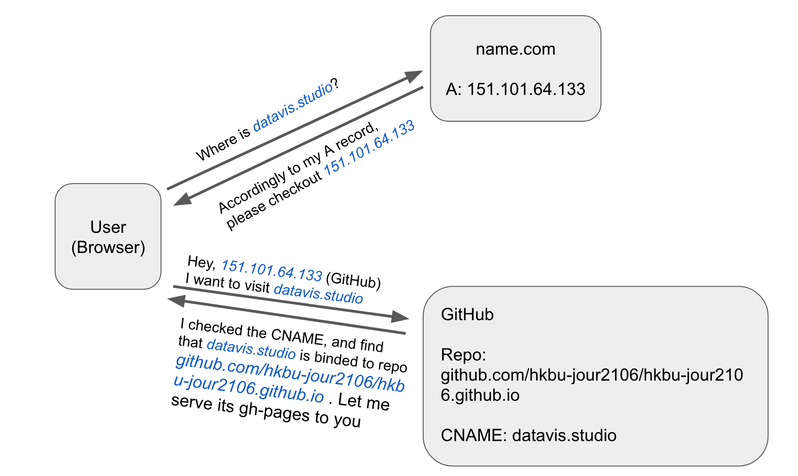

Checkout [this article](https://www.verisign.com/en_US/website-presence/online/how-dns-works/index.xhtml) for how DNS works.

## Bonus: Collaboration on GitHub

### The workflow Fork repo, modify code and send pull Request

#### Fork repo

Simply speaking, `fork` means to get a `copy` of a repo to your own account so that you can have authority to modify the codes, change files.

For example, one can fork a copy of our weekly notes [here](https://github.com/hupili/python-for-data-and-media-communication-gitbook):

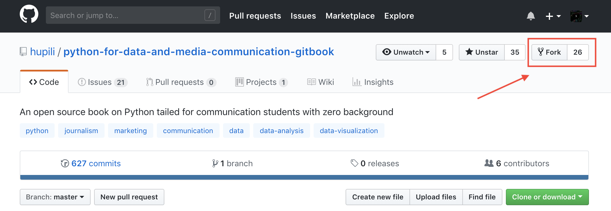

After you forked, visit to your profile, you can find there is an copy of the our openbook in your repos. You can also find the information of the upstream repository.


#### Modify code

After you get the copy of one repo, you can clone to the local, and the following are all we've already learned, modify the codes by text editor or add your Jupyter notebooks, commit your changes, push it to the remote.

#### Pull Request

As we discussed, the forked repo is only a copy of the original, and in a collaborative projects, there might be many different forked repos, every part of the team modifies their codes and files separately. So how to merge those separate changes in to a complete one? `pull requests` is to solve the problem. After we pushed our changes to our repos. We can click pull request, give the summary of the request and commit. Basically, it tells the original repo owners that we want to merge our modified codes/files to the original repo. GitHub will automatically check whether your branch has conflicts with the original branch or not. If there is no conflict, the original owner can decide whether they accept your changes or not, if do, they will merge your changes into the original one. That's basically how we collaborate in GitHub.


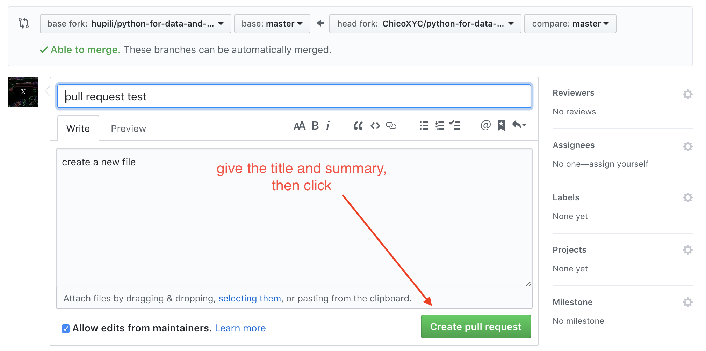

The owner will decide whether accept your requests or not, if they merge the requests, the repo you want to merge will be updated.

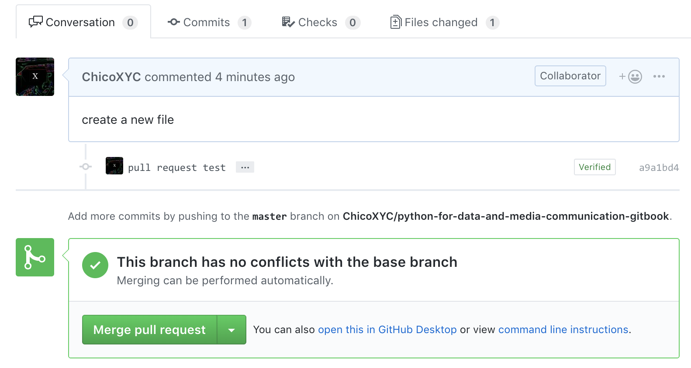

**NOTE**: The Pull Request is not an one-off effort. If your modification is sub optimal, the maintainer of the project may request further revisions. The discussion thread of a PR is used for this purpose. GitHub's PR system is very expressive. You can also comment on a specific line of a specific version (commit) if you want. When there is new version, the initiator does not have to create a new PR. As soon as the initiator pushes new commits to the original source branch, the updates will appear in the PR thread. See this workflow in action from [this example](https://github.com/hupili/python-for-data-and-media-communication/pull/11).

## A first journey into the open source world

GitHub adopts a "sharing first" principle in its community. Whatever content you create *publicly* on GitHub is available for other GitHub users to view and reuse *within GitHub's functionality*. Some respectful and cautious users may not feel comfortable to work on derivatives of your work in other channels. You can grant them such permissions via some common open source license.

### Common licenses

The short take-away for 

- GPL -- You can use the content freely, but your derivative work based on a GPL licensed project is required to be open source.
- MIT -- Do whatever you want. You are obligated to provide attribution with your code or binary \(e.g. say "this project uses code that is MIT licensed" -- with a copy of the license and copyright of the author of the open source code\).
- Creative Commons -- There are several levels. CC0 is least restricted. It is basically "Public Domain". You can use other levels of CC or combinations of CC keywords to specify the usage rights. For example, this repo is licensed under "CC-BY-NC-ND", meaning:
  - BY: attribute to the author when you use
  - NC: non-commercial use only
  - ND: no derivatives -- you can share but can only share in its original format.

Of course, the non granted rights are always negotiable with the authors who own the content. The spirit of open source is to cater to the greater good, while protect the authorship. There is a flow chart for you to decide what license you should choose.

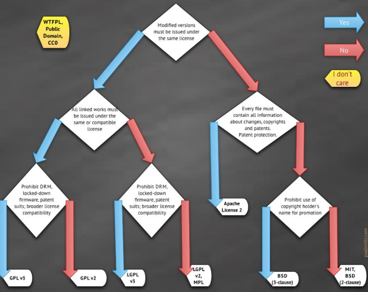

### Ethics and Code of conduct

GitHub adopts a **"sharing first"** principle. In most cases, you can feel free to fork others project and drive the works within GitHub's eco-system. Even when the license is restrictive, you can still do so for study and research purpose, based on the commonly adopted **"fair use"** principle, under the condition that original authors are proper acknowledged.

When you talk with people on GitHub, try to keep the message precise and concise. This is to save everyone's time. Besides, please refrain from irrelevant discussions or meaningless messages. [This article](https://www.pingwest.com/a/177413) from PingWest pointed out to some common mis-conducts on GitHub.

## Exercises and Challenges

### Browse past student projects

- [Data Projects Archive](https://github.com/data-projects-archive) is the archive for our student data projects from various related courses. Try to navigate those repositories (repo) and:
  - Find the presentation slides and final report (if available).
  - Find the code and data.
  - Check the commit history to roughly understand how the project evolves.
  - Challenge: before learning any programming or data analysis/ visualization skills, can you figure out the major steps of a data project by exploring Git?

### Raise a question

Go to the [issue tracker of this repo](https://github.com/hupili/python-for-data-and-media-communication-gitbook/issues) and create a new issue to ask for a question.

### Participate in a discussion thread

Find a meaningful discussion thread on issue tracker and join the discussion. Sometimes, students might share their solution if they find alternative ways than the ones given in our text book. Here is [one example thread](https://github.com/hupili/python-for-data-and-media-communication-gitbook/issues/34).

### Bonus: conduct a survey of related reading materials on GitHub

Try out GitHub's search function. See if you can find other open courses, books, tutorials, sample codes, that are related with this course. Please note down your findings. A short description and information about difficulty/ relevance will help your future reference.

### Bonus: fork - modify - Pull Request (PR)

Following up the previous challenge, you may want to suggest new entries into our reading material list on [reading-materials.md](https://github.com/hupili/python-for-data-and-media-communication-gitbook/blob/master/reading-materials.md#related-github-repos). Please operate in the following steps:

- Fork the current repo
- Modify the forked version (under your own name). You can do this all with in browser. Just enter the editor from GitHub website.
- After you save (commit) the works, you can send a Pull Request (PR) to the current repo. Someone from our team will review the changes and merge/ close the PR.

## References and further reading

- [Jupyter Notebooks from S2018 students](https://github.com/data-projects-archive/). You can check out some projects and their notebooks to get more familiar with Jupyter Notebook.
- [GitHub official guide](https://guides.github.com/). You can basically learn everything about GitHub in it's guide.
- GitHub and GitHub Desktop are just two graphical ways to operate the powerful version control system, **"Git"**. Interested readers cna further study the command line from this online resource: <https://try.github.io/>

------

If you have any questions, or seek for help troubleshooting, please [create an issue here](https://github.com/hupili/python-for-data-and-media-communication-gitbook/issues/new)