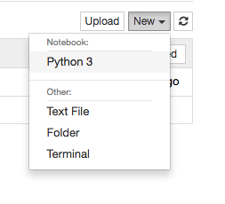
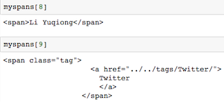
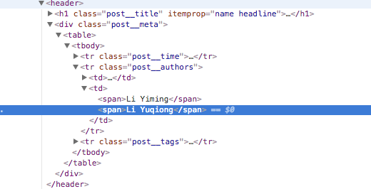

# Week 05

# 1. Jupyter notebook

* 1.As we have downloaded python2 and python3, there are some conflicts to run some programs when we import modules.
* 2.We can debug step by step.It is convenient when we are writing a complicated coding.

So it is suggested to enter virtual environment before using Jupyter notebook.

### Tnstall modules in terminal

```
pip3 install --user requests
pip3 install --user bs4
pip3 install --user lxml
```

### Start venv
[https://hupili.gitbooks.io/python-for-data-and-media-communication/content/module-jupyter.html](https://hupili.gitbooks.io/python-for-data-and-media-communication/content/module-jupyter.html)

* Then you will see a page [http://localhost:8888/tree](http://localhost:8888/tree). \(As long as you are in the virtual environment, you can go to this link to write code.\)
* A directory named 'venv' is on your desktop now. The files you put here can be run in the virtual environment by jupyter.

### Tips of usage:

##### Q1: How to quit the last steps's situation?


A:
The answer is in the picture: control+C. \( Pay attention to the text. \)Then you will get the following picture.Please input `y` in 5 seconds.


##### Q2:How to quit from virtual environment?


A: input `deactivate`

##### Tab & type & help & print
There are some useful tips for you.

* tab
If we input the `mypage.t`, then `tab`, we will find there are other commands\(functions\),including tag\_name, text and so on.

* `type` to check the object. It is very useful when we write complicated codings.
eg:
```
a=1
type(a)
b="hello"
type(b)
```
You will get:
```
int
str
```

* `help(str.strip)` to know the details.

* `print` step by step to check where is the error.
\(In Jupyter, you can just input the variables without the function of print.\)


### Open a new file

* `shift+return` to run the code.


# 2.Knowledge about HTML

### The process of search engines\(like Baidu\)'s work

1. Crawl web pages
2. Store those web pages
3. Build reverse index,which means making a relationship between the keyword and web page.
4. Extract page-level features

### Html JS css


* HTML is a machine language of web page. Writing something in HTML means to create a web page.It is a structure of diverse tags. Those tags are in pairs,with open tag and closing tag.
* css and JS are other languages, which is used to describe the style of the web page,such as the characters' style and colour.

### Chrome Develop Console

* It is suggested to use 'Chrome' as our browser.
* In Chrome, `option+command+i` to open the Chrome develop console.
* Click the upper left corner of the console,and you will find that by moving the mouse in the web, you can see the part in console.
* eg:


# 3.Scraper
### Import modules
```
import requests
import bs4
import csv
```
* `requests` is a module containing diverse functions relating to the web page.

* `bs4` is the abbreviation of BeautifulSoup4.It is used to analyse web page.

### Requests + .text
```
r = requests.get('http://initiumlab.com/blog/20170329-trump-and-ivanka/'
r.text
```
It can be wrote in one line.

`r = requests.get('http://initiumlab.com/blog/20170329-trump-and-ivanka/').text`

* Store the web as `r`, `get` means try to get response of that web page.

* `text` means to show the text of the web page.

### BeautifulSoup
```
from bs4 import BeautifulSoup
mypage = BeautifulSoup(r.text)
```
* `BeautifulSoup` is to extract the web's content.
It relies on certain engine to analyse. `lxml` is one of the engine. By default, it will choose the best engine.

* Warning is not an error. So no need to worry at this stage.


### Find + strip\(\) to get title
>`h1 class="post__title" itemprop="name headline"> 特朗普父女推特解密</h1
`

* Open the console, by moving the mouse you can find title is in `<h1........</h1>`.(see the above 'html' part.)

```
myh1 = mypage.find('h1')
mytitle = myh1.text
mytitle.strip()
```

* `find` to find what we want, and output the first item.
* `find_all` means output all we find. 
* `strip()`means delete the meaningless coding.
* You can `help(str.strip)` to see the usage of strip.

### Get date
>```
<time itemprop="dateCreated" datetime="2017-03-29T....." content="2017-03-29">
                  2017-03-29
                </time>
```

```
mydate = mypage.find('time').text.strip()
```

### Get author \(Important\)
##### Try 1:fail
`myauthor = mypage.find('span')`


* It is not what we want, as there are too many 'span'.So check how many span there, and find the difference between those tags. `command+f` to open the search bar in console,and input 'span'.You can see, there are more than 2 'span'.

`myspans = mypage.find_all('span')`

* `find_all` means output all the items it finds.
* `find` means only output the first one.

* 'myspans' is a list. 
 `myspans[0]`means extract the first one in the list.
 `myspans[1]`means extract the second one in the list.

##### Try 2:succeed to find all the authors

> 

* In the HTML, we can find that authors upper tag is 'td'. But there are too many td. And it is difficult to be specific.

* As 'tr' has class, which means more specific than 'td', so try to locate the more upper file: 'tr':

`len(mypage.find_all('tr')`
>`5`

* There are 5 tr. We have to narrow the area to search the 'span'.

`mytr = mypage.find('tr', attrs={'class': 'post__authors'})`

* `attrs`= attributes. You can add more detailed information about tr, which helps to locate the tr. 


`mytr` 
>```
<tr class="post__authors">
<td>.......</td>
<td>
<span>Li Yiming</span>
<span>Li Yuqiong</span>
</td>
</tr>
```

`mytr.find_all('span')`
>`[<span>Li Yiming</span>, <span>Li Yuqiong</span>]`


##### Try to output those authors.
```
authors = []
for myspan in mytr.find_all('span'):
    authors.append(myspan.text)
```

* Create a new empty list called 'authors'. Then add the information in it.

* `list1.append()`means add the item into the list1.

```
article = {
    'title': mytitle,
    'authors': authors,
    'date': mydate
}
```
* `{}` is a dictionary.The left of the colon is the key, or name. The right of the colon is the value of the key.


### Def to scraper more articles                                                                       
```
def scrape_one_page(url):
    r = requests.get(url).text
    mypage = BeautifulSoup(r,'lxml')
    mytitle = mypage.find('h1').text.strip()
    mydate = mypage.find('time').text.strip()
    mytr = mypage.find('tr', attrs={'class': 'post__authors'})
    authors = []
    for myspan in mytr.find('span'):
        authors.append(myspan)
    article = {
        'title': mytitle,
        'authors': authors,
        'date': mydate
    }
    return article
```
* Create a function for future.

* Following is an example of the function`scrape_one_page` 's usage:
`print(scrape_one_page('http://initiumlab.com/blog/20170401-data-news/'))`


### "For" loop to scraper more articles
```
urls = [
    'http://initiumlab.com/blog/20170407-open-data-hk/',
    'http://initiumlab.com/blog/20170401-data-news/',
    'http://initiumlab.com/blog/20170329-trump-and-ivanka/'
]

articles= []
for url in urls:
    article= scrape_one_page(url)
    articles.append(article)
print(articles)
```
* Input a list of urls. Create an empty list called articles. For every urls' meaningful information, use the `scrape_one_page` function to extract.Then add those into the articles.


### Write .csv
```
with open('eggs.csv', 'w') as f:
    writer= csv.writer(f)
    for article in articles:
        writer.writerow([
            article['authors'],
            article['date'],
            article['title']
        ])
```
* We can save those infornation with in different ways. `csv` is one of the types which can be easily opened and read.

* `with open ('eggs.cdv','w') as f:` means create a file called 'eggs.csv'. 'w' is one of the way to open it, which is usually in default. 'as f' means that when we write f, it equals to open the file.

* `csv.writer` means edit a csv file.

* `writer.writerow([])` means add information in row. It can be wrote like this `s.writerow(['Spam', '1', '2', '3'])`

## Exercises and Challenges

Some scrapers and the output dataset from our past students:

* [HK Carpark price data](https://github.com/XIAO-Chao/hkbu-big-data-media/tree/master/homework2)
* [Qidian](https://github.com/DaisyZhongDai/hkbu-big-data-media/tree/master/homework2)
* [CTrip scenic point data](https://github.com/marla322/hkbu-big-data-media/tree/master/HW2)
