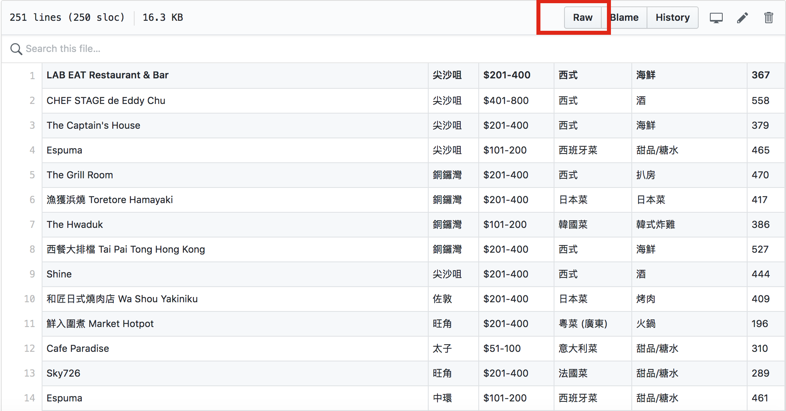
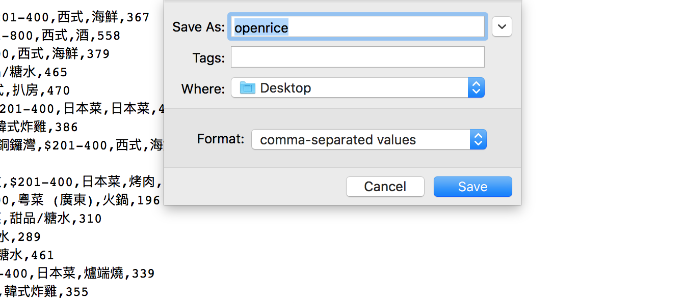

# Week 07 - Work with table: data cleaning and pre-processing

<div id="toc">

<!-- TOC -->

- [Week 07 - Work with table: data cleaning and pre-processing](#week-07---work-with-table-data-cleaning-and-pre-processing)
    - [Objective](#objective)
    - [Preparation](#preparation)
        - [Python environment](#python-environment)
        - [Download data file from a GitHub repo](#download-data-file-from-a-github-repo)
    - [`pandas` introduction](#pandas-introduction)
        - [Load table (DataFrame) from local csv file](#load-table-dataframe-from-local-csv-file)
        - [Load table (DataFrame) from a URL](#load-table-dataframe-from-a-url)
        - [Select data](#select-data)
        - [Basic statistics](#basic-statistics)
        - [Data cleaning and pre-processing](#data-cleaning-and-pre-processing)
        - [Filtering](#filtering)
        - [Sorting](#sorting)
    - [Export from `pandas`](#export-from-pandas)
        - [Bonus: Python and Javascript in action](#bonus-python-and-javascript-in-action)
    - [Dataprep](#dataprep)
        - [Cleaning](#cleaning)
        - [Transformation](#transformation)
        - [Extraction](#extraction)
    - [References](#references)

<!-- /TOC -->

</div>

## Objective

- Master the basic of `pandas`
- Can perform data cleaning and pre-processing via table manipulation
- Can use `pandas` as "Excel in Python"

<!-- - Master the schema of "data-driven story telling": the crowd \(pattern\) and the outlier \(anomaly\)
- Can efficiently manipulate structured table formatted datasets
- Use `pandas` for basic calculation and plotting -->

<!-- Modules:

* `pandas`
 -->
 
Datasets to work on:

* [openrice.csv](https://github.com/hupili/python-for-data-and-media-communication/tree/master/w6-pandas) contributed by group1 of S18 session.

<!-- TODO: Scrape an updated version of this dataset from openrice. Take note here of the scraping parameters, e.g. type, time range, price range, etc. -->

-------

**TODO: following notes are scribed by S18 student helper. Need further organisation**

## Preparation

### Python environment

Please install dependencies in your virtual environment via following shell commands:

```python
pip install pandas, seaborn, matplotlib, requests, csv
```

If you are already in Jupyter notebook, you can prefix the command with `!` in order to execute execute shell command in a Jupyter notebook cell.

### Download data file from a GitHub repo

> Example: Today, We will use the data from Openrice as an example and do the restaurant analysis. Assuming that we have already got certain amount of data from Openrice and saved it into csv file.

Here is the link of csv life and the csv needs to be downloaded here.

[https://github.com/hupili/python-for-data-and-media-communication/tree/master/w6-pandas](https://github.com/hupili/python-for-data-and-media-communication/tree/master/w6-pandas)


Click "raw" on the right upper corner.  



You can see the raw csv file as below.


Click right and choose "save as"  


Then the csv file can be saved as csv\(comma-separated values\).  



## `pandas` introduction

### Load table (DataFrame) from local csv file

* Put csv file into the same folder with venv.
* `import pandas`
* Read csv file 
  `pandas.read_csv('openrice.csv')`
* The output will be as below:
  
* If there is no header in the csv file.We can use `Pandas` as below to add proper headers for a form.

  ```
  df = pandas.read_csv('openrice.csv', header=None, names=['name', 'location', 'price', 'style', 'type', 'likes'])
  ```

  then the output will be like this:  
    
  ** Notes:**

* `df`is short for "dataframe", is used in as return value in pandas.

### Load table (DataFrame) from a URL

<!-- TODO: show that one can load CSV from GitHub directly -->

### Select data

<!-- Select by rows or by columns -->

* If you want to the first 10 data from the csv file. then you can use

  ```
  df.head(10)
  ```

  the output will be as blow:  
  

* If you want to select one column. You can use dataframe as a dictionary, use a key to refer to certain value. For example, you want all the restaurant locations.You can type:

  ```
  df['location']
  ```

  Then the output will be as below \(the picture do not show all the locations due to the limited space\):  
  

### Basic statistics

* One dimension is one column in a form.
* You can use   
  `df['location'].value_counts()`  
  then the output will be as below, showing you how many likes each restaurant have got.  
  
* Then you may need to calculate certain dimension. For example, how many likes that each restaurant have got. First, you will get all "likes" column data as follow:  
    
  then, you need to to know the mean, media, percentile, min,max number of this dimension as below:  
  

* then you can put these filter data into a distribution, using  
  `df['likes'].hist()`  
  and you can get a distribution like below:  
  

* if you want to see change parameter, you can use  
  `df['likes'].hist(bins=20)`  
  


<!-- TODO: DataFrame.describe() -->

### Data cleaning and pre-processing

Clean the data and convert price range to numeric values

<!-- TODO: master the `apply` and `lambda` pattern -->

* After you get the distribution, you can do some analysis. Compare the distribution with mean, media numbers.
  
* If you need to compare price which is a interval.You need to pay special attention on numbers. Python recognize '$101-200'&lt;'$51-100' because Python only compare the  
  numbers in sequence of each interval.

  You need to convert each interval string into numbers, which means you need to choose a number to represent each interval to do comparison.  
  Here, we use "mapping" function

  ```
  mapping = {
    '$101-200': 200,
    '$201-400': 400,
    '$51-100': 100,
    '$401-800': 800,
    '$50以下': 50
  }
  ```

* Now, you can use:

  ```
    original_string = '$60以下'
    mapping.get(orignal_string, 0)
    def cleaning(e):
    return mapping.get(e, 0)
    cleaning('$50以下')
  ```

  

* Then you can use the code below to transfer intervals into numbers.

  `df['price_num'].apply(cleaning)`

  

### Filtering

<!-- TODO: the df[ condition ] pattern -->

<!-- TODO:
- filter by numeric range
- filter by exact value
- filter by strings
- filter by more than two conditions -->

* If you want to know how many restaurants having likes is 558, or less than 60, then you can use filter function:  
  `df[df['likes'] == 558]`  
  `df[df['likes'] < 60]`

  the output will be as below:  
  

* If you want to select location of Mongkok.

  ```
    df1[
       df1['location'] == '旺角'
      ]
  ```

  the output will be:  
  

* If you want to select the seafood restaurants with price number less than 100.  
  

### Sorting

* If you want to sort price from high to low.

  ```
    df.sort_values(by='price_num', ascending=False)
  ```

  the output will be  
  


## Export from `pandas`

After you finish processing data in `pandas`, you may want to export it

- to store the dataset for later analysis.
- to convert it into a format that can be used by Frontend developers to make interactive web visualisations.

The common export formats are:

- `to_csv`
- `to_dict`
- to JSON format

<!-- TODO: workout the above export method -->

### Bonus: Python and Javascript in action

A very common workflow is to process data in Python and visualize data in Javascript. The last interactive chart in this [blog post](http://initiumlab.com/blog/20160730-Voting-Preference-Analysis-for-Hong-Kong-Legislative-Council-2012-2016/#%E8%AD%B0%E5%93%A1%E5%9B%9B%E5%B9%B4%E6%8A%95%E7%A5%A8%E5%82%BE%E5%90%91%E8%AE%8A%E5%8C%96) shows the political preference variation of HK legco members during the 2012-2016 term. The interactive chart is made by [echarts](https://ecomfe.github.io/echarts-doc/public/en/index.html), a popular Javascript library for interactive visualisation from Baidu. However, the data collection and heavy duty data analysis are done in Python. We conducted the analysis in Python and export the `pandas.DataFrame` into a `JSON` format that can be consumed by echarts. You can checkout the [JSON file here](http://initiumlab.com/blog/20160730-Voting-Preference-Analysis-for-Hong-Kong-Legislative-Council-2012-2016/echarts-option-legco-5.json).

The key takeaway is that data files like `json`, `csv` and `xml` are usually the bridge between frontend (e.g. Javascript) and backend (e.g. Python).

## Dataprep

You need to finish "Dataprep" before analysis. That is, we start with structured data. Preparing the structured and cleaned data has no common schema. A data scientist regularly spends most of the time in dataprep. We have pointers in [Dataprep](dataprep.md) for your own reading, including some non-Python dataprep tools/ platforms. Now that we learned the basics of `pandas`, we can conduct the dataprep workflow all in Python.

Here is a polluted dataset from original openrice scraped data. Please try to combine pandas knowledge above and following guidelines to prepare a structured data that is good for further analysis.

### Cleaning

- Check the variable distribution. Is there any special value that only appears once or a few times? Will it be a typo?
- Check the variable range. What is the common range of values in this variable? Is there any peculiar value?
- Check the string length. Is there a super long cell? It may be because parsing error during scraping stage. Some data may mix up.
- Check the missing values. Are there empty cells? What is the reasonable default value to fill in those empty cells?
- Check the above on a subset of data (filtering/ grouping). Does `50` looks like a regular price? Does `50` looks like a regular price within "seafood" category?

### Transformation

- Convert text value to numeric value. e.g. convert price range text into a representative number that can be sorted.
- Merge multiple categories. e.g. merge `港式` and `潮州菜` into `中式`. Sometimes, less categories help analysis. You may need some domain knowledge and trials and errors, in order to find good method of grouping.
- Encoding, many times called "coding" in social science research, is the process of turning natural language data into numeric data. This is also a mantter of domain knowledge but you can try the method here. e.g. in order to study the relationship between price range and the income level of that district, we can encode 18 districts into three income class `high`, `medium` and `low`.

### Extraction

We load the CSV data in one shot, because the current dataset is very small. In real practice, you may meet a large dataset, so the first step is usually data extraction. One can do extraction by certain rules, e.g. get the restaurants in a certain district, get the restaurants that are open in a certain time period. Or you are interested in the whole population but do not possess the appropriate computation power to handle this dataset. At this point, you may want to do sampling. `DataFrame.sample()` may be helpful here. When dealing with really large dataset, you may want to combine extraction by rule and extraction by sampling.

## References

* First two chapters \(i.e. before "3D"\) of the article [The Art of Effective Visualization of Multi-dimensional Data](https://towardsdatascience.com/the-art-of-effective-visualization-of-multi-dimensional-data-6c7202990c57) by Dipanjan Sarkar
* [Exercise numpy](https://www.shiyanlou.com/courses/1090) on ShiYanLou
* [Exercise pandas](https://www.shiyanlou.com/courses/1091) on ShiYanLou

------

If you have any questions, or seek for help troubleshooting, please [create an issue here](https://github.com/hupili/python-for-data-and-media-communication-gitbook/issues/new)
