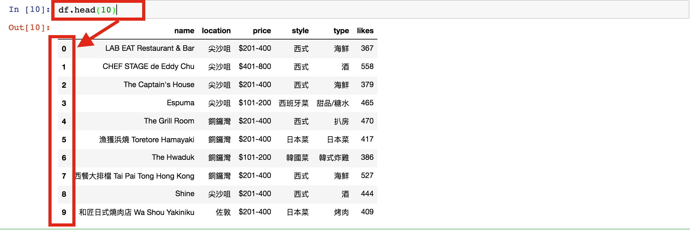

# Week 07 - Work with table: data cleaning and pre-processing

<div id="toc">

<!-- TOC -->

- [Week 07 - Work with table: data cleaning and pre-processing](#week-07---work-with-table-data-cleaning-and-pre-processing)
    - [Preperations Before Data Analysis](#preperations-before-data-analysis)
    - [Use "Pandas" to do Data Analysis](#use-pandas-to-do-data-analysis)
        - [Step1: Save csv file](#step1-save-csv-file)
        - [Step2: Read csv file](#step2-read-csv-file)
        - [Step3: Select data from csv](#step3-select-data-from-csv)

<!-- /TOC -->

</div>


**Objective**:

> * Master the schema of "data-driven story telling": the crowd \(pattern\) and the outlier \(anomaly\)
> * Can efficiently manipulate structured table formatted datasets
> * Use `pandas` for basic calculation and plotting

Modules:

* `pandas`

Datasets to work on:

* [openrice.csv](https://github.com/hupili/python-for-data-and-media-communication/tree/master/w6-pandas) contributed by group 1

References:

* First two chapters \(i.e. before "3D"\) of the article [The Art of Effective Visualization of Multi-dimensional Data](https://towardsdatascience.com/the-art-of-effective-visualization-of-multi-dimensional-data-6c7202990c57) by Dipanjan Sarkar
* [Exercise numpy](https://www.shiyanlou.com/courses/1090) on ShiYanLou
* [Exercise pandas](https://www.shiyanlou.com/courses/1091) on ShiYanLou

Additional notes:

* You need to finish [Dataprep](dataprep.md) before analysis. That is, we start with structured data. Preparing the structured and cleaned data has no common schema. We have pointers in [Dataprep](dataprep.md) for your own reading.


-------

**TODO: following notes are scribed by S18 student helper. Need further organisation**

## Preperations Before Data Analysis 

**Notes:**

* Before learning, we will use jupyter notebook here, please enter venv environment first and enter into jupyter notebook.
* install pandas, seaborn, matplotlib, requests, csv

  ```
  pip install pandas
  ```

  ```
  pip install seaborn
  ```

  ```
  pip install matplotlib
  ```

## Use "Pandas" to do Data Analysis

> Example: Today, We will use the data from Openrice as an example and do the restaurant analysis. Assuming that we have already got certain amount of data from Openrice and saved it into csv file.

### Step1: Save csv file

* Here is the link of csv life and the csv needs to be downloaded here.

  [https://github.com/hupili/python-for-data-and-media-communication/tree/master/w6-pandas](https://github.com/hupili/python-for-data-and-media-communication/tree/master/w6-pandas)

  

* Click "raw" on the right upper corner.  
  

* You can see the raw csv file as below.   
  

* Click right and choose "save as"  
  

* Then the csv file can be saved as csv\(comma-separated values\).  
  

### Step2: Read csv file

* Put csv file into the same folder with venv.
* `import pandas`
* Read csv file 
  `pandas.read_csv('openrice.csv')`
* The output will be as below:
  
* If there is no header in the csv file.We can use `Pandas` as below to add proper headers for a form.

  ```
  df = pandas.read_csv('openrice.csv', header=None, names=['name', 'location', 'price', 'style', 'type', 'likes'])
  ```

  then the output will be like this:  
    
  ** Notes:**

* `df`is short for "dataframe", is used in as return value in pandas.

### Step3: Select data from csv

* If you want to the first 10 data from the csv file. then you can use

  ```
  df.head(10)
  ```

  the output will be as blow:  
  

* If you want to select one column. You can use dataframe as a dictionary, use a key to refer to certain value. For example, you want all the restaurant locations.You can type:

  ```
  df['location']
  ```

  Then the output will be as below \(the picture do not show all the locations due to the limited space\):  
  

** Step4: Analysis just one dimension**

* One dimension is one column in a form.
* You can use   
  `df['location'].value_counts()`  
  then the output will be as below, showing you how many likes each restaurant have got.  
  
* Then you may need to calculate certain dimension. For example, how many likes that each restaurant have got. First, you will get all "likes" column data as follow:  
    
  then, you need to to know the mean, media, percentile, min,max number of this dimension as below:  
  

* If you want to know how many restaurants having likes is 558, or less than 60, then you can use filter function:  
  `df[df['likes'] == 558]`  
  `df[df['likes'] < 60]`

  the output will be as below:  
  

* then you can put these filter data into a distribution, using  
  `df['likes'].hist()`  
  and you can get a distribution like below:  
  

* if you want to see change parameter, you can use  
  `df['likes'].hist(bins=20)`  
  

**Step5: How to describe distribution **

* After you get the distribution, you can do some analysis. Compare the distribution with mean, media numbers.
  
* If you need to compare price which is a interval.You need to pay special attention on numbers. Python recognize '$101-200'&lt;'$51-100' because Python only compare the  
  numbers in sequence of each interval.

  You need to convert each interval string into numbers, which means you need to choose a number to represent each interval to do comparison.  
  Here, we use "mapping" function

  ```
  mapping = {
    '$101-200': 200,
    '$201-400': 400,
    '$51-100': 100,
    '$401-800': 800,
    '$50以下': 50
  }
  ```

* Now, you can use:

  ```
    original_string = '$60以下'
    mapping.get(orignal_string, 0)
    def cleaning(e):
    return mapping.get(e, 0)
    cleaning('$50以下')
  ```

  

* Then you can use the coding below to transfer intervals into numbers.

  `df['price_num'].apply(cleaning)`

  

* If you want to select location of Mongkok.

  ```
    df1[
       df1['location'] == '旺角'
      ]
  ```

  the output will be:  
  

* If you want to select the seafood restaurants with price number less than 100.  
  

* If you want to sort price from high to low.

  ```
    df.sort_values(by='price_num', ascending=False)
  ```

  the output will be  
  

------

If you have any questions, or seek for help troubleshooting, please [create an issue here](https://github.com/hupili/python-for-data-and-media-communication-gitbook/issues/new)

-------


