# Week 9 - Graph analysis

<div id="toc">

<!-- TOC -->

- [Week 9 - Graph analysis](#week-9---graph-analysis)
    - [Common license](#common-license)
    - [Basic preparations](#basic-preparations)
        - [Pip install all the modules by one step](#pip-install-all-the-modules-by-one-step)
        - [Jupyter display to show the picture](#jupyter-display-to-show-the-picture)
        - [Markdown to show a picture](#markdown-to-show-a-picture)
        - [HTML link](#html-link)
    - [Graph](#graph)
        - [Count the edge](#count-the-edge)
        - [Network example](#network-example)
        - [Get data by json](#get-data-by-json)
        - [Visualization Spring layout](#visualization-spring-layout)
        - [Color specific nodes](#color-specific-nodes)
        - [Shortest path](#shortest-path)
        - [Centrality Measures](#centrality-measures)
        - [Structure degree](#structure-degree)
        - [Clustering coefficient](#clustering-coefficient)
        - [Cliques part of the graph](#cliques-part-of-the-graph)
        - [Connected components](#connected-components)
        - [Community detection](#community-detection)
        - [Color the nodes](#color-the-nodes)

<!-- /TOC -->

</div>

## Common license

* GPL=use freely. But your work based on GPL is required to open source.
* GNU=general public license 
* MIT=do whatever you want. You are obligated to provide attribution with your code or binary \(e.g. say "this project uses code that is MIT licensed" -- with a copy of the license and copyright of the author of the open source code\).
* There are 2 pictures for reference.  


## Basic preparations

### Pip install all the modules by one step

* First of all, download the requirements.txt from  [https://github.com/hupili/python-for-data-and-media-communication](https://github.com/hupili/python-for-data-and-media-communication) to your desktop.This file is a list of many modules. So you only need to do this for once to have all the packages.

* Check on your virtual environment to make sure you have this file.  
  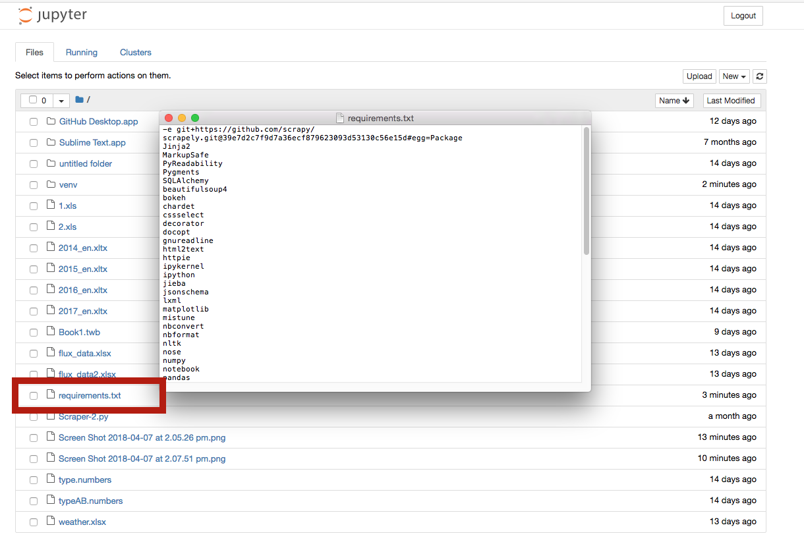


### Jupyter display to show the picture

* Create a picture called "picture.png" on your repository on folder 'venv', as follows.  
  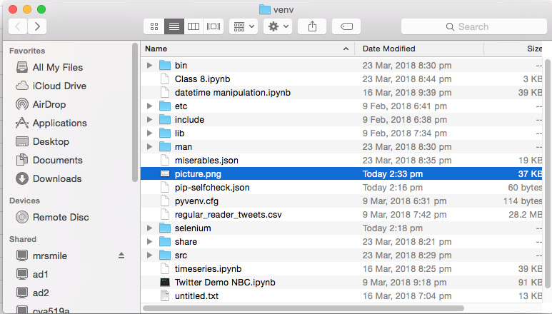

  ```
  jupyter notebook
  ```

  Open jupyter notebook and then create a new python file under the 'venv' folder. Then write the code as follows.

  ```
  from IPython.display import Image
  Image("picture.png")
  ```

  

### Markdown to show a picture

* Change to the markdown environment in jupyter notebook as follows.  
  

  ```
  
  ```

  

### HTML link

  ```
  from IPython.core.display import HTML
  HTML('<a href="http://example.com"link</a')
  ```

  

* Block quote, or ''' ''', is to quote code.   
  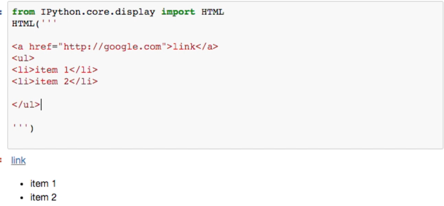

## Graph

### Count the edge

* Represents of the graph.
 


* Try to count the edge between those circles.

     
   This undirected table is symmetric. It shows that 1 and 2 has one edge. 2 and 3 is the same.   
     
   The above one is directed.

* There are different ways to show the relationships.
   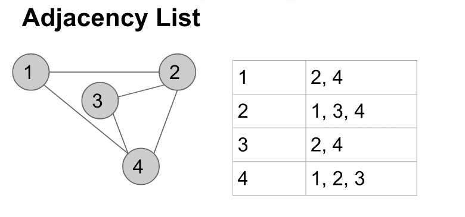  
     
     
   Then we can infer the list.

### Network example

  ```
  import networkx as nx
  g=nx.Graph()
  ```

  

  ```
  g.add_node('A')
  g.add_node('B')
  g.add_node('C')
  ```

  It adds the nodes. Then`g.nodes` to check.  
  

  ```
  g.add_edge('A','B')
  ```

  It adds egdes between A and B. Then`g.nodes` and`g.edges` to check.  
  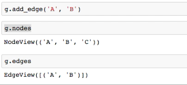

  ```
  nx.draw(g)
  ```

  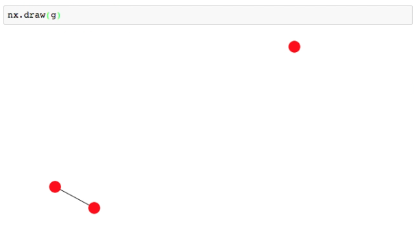

  ```
  g.add_edge('C','B')
  nx.draw(g)
  ```

  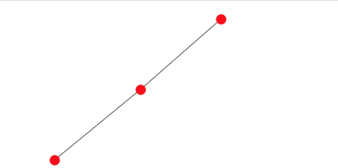

### Get data by json

  ```
  import json
  content=open('miserables.json').read()
  data=json.loads(content)
  ```

   
 The content is an object.

   
 `json.loads` is to load a string which is given by content. Then data becomes the python structure.

  ```
  type(data)
  data.keys()
  data['nodes']
  data['links']
  ```

   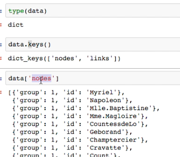  
   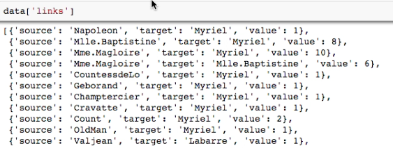  
   Check the data. There are many nodes called 'group' and 'ID' and links called 'source' and 'target'.
  ```
  for n in data['nodes']:
  g.add_node(n['id'],group=n['group'])
  ```

  `n['id']` means extracting the id from every item in data\[nodes\], and add them into g.  
  `g.number_of_nodes` and `g.number_of_edges` to check the node.

  ```
  for l in data['links']:
  g.add_edge(l['source'],l['target'], **l)
  ```

  `**l` is an attribute. It means to take every item in 'key-value' pairs. So it equals to

  ```
  l['source'],l['target'], source=0,target=0,value=0
  ```

### Visualization Spring layout

* 'spring layout' is another name for 'force directed layout'.

  ```
  import matplotlib 
  %matplotlib inline
  nx.draw(g)
  ```

  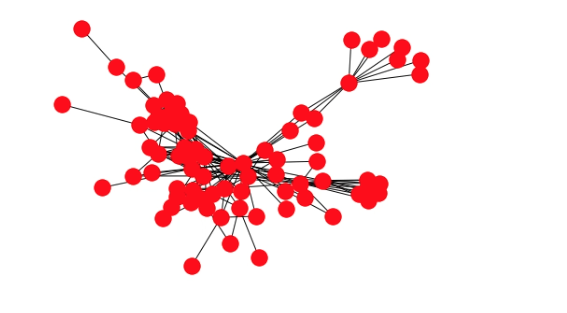

  ```
  from matplotlib import pyplot as plt
  plt.figure(figsize=(20,20))
  pos=nx.spring_layout(g)
  nx.draw_networkx_nodes(g,pos,node_color='#ccccff',alpha=0.5)
  nx.draw_networkx_edges(g,pos,width=1,alpha=0.3)
  labels=dict([(n,n)for n in g.nodes])
  _=nx.draw_networkx_labels(g,pos,labels=labels,font_color='#666666')
  ```

  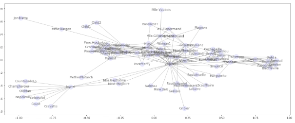

* The above one is the basic graph.

   
 `plt.figure(figsize=(20,20))` to change the size.  
 `nx.draw_networkx_nodes` and `nx.draw_networkx_edges` to draw the nodes and edges.  
 `labels=dict([(n,n)for n in g.nodes])` and `_=nx.draw_networkx_labels` to draw the labels. Create a dict\[\(n,n\)\], whose n is from g.nodes

### Color specific nodes

  ```
  g.nodes['Anzelma']
  ```

    
  We know the content of g.nodes

  ```
  import matplotlib
  color=matplotlib.cm.Accent
  color(10)
  ```

    
  `matplotlib.cm` is a useful tool. You can try by yourself.It shows the R\(red\), G\(green\), B\(blue\) and alpha.

  ```
  for group in range(1,20):
  nodelist=[n for n in g.nodes if g.nodes[n]['group']== group]
  nx.draw_networkx_nodes(g,pos,nodelist=nodelist,node_color=color(group),alpha=0.8)
  ```


 
 If g.nodes's group = 1, add those nodes into the nodelist. They will be the same color 1 . If g.nodes's group = 2, they will be added to another nodelist ,and be colored 2.

### Shortest path

  ```
  sp=nx.shortest_path(g,'XXX','XXX')
  ```

    
  It shows the shortest way between the two nodes.

  ```
  #base on the above graph
  nx.draw_networkx_edges(g,
  pos,
  edgelist=list(zip(sp[:-1],sp[1:])),
  width=5,
  edge_color='r'
  )
  ```

     
   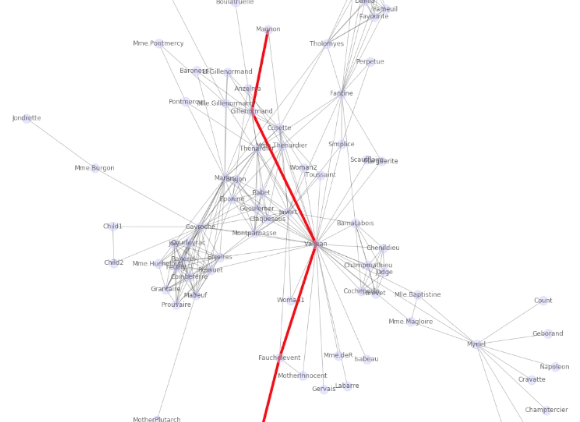

### Centrality Measures

* **Degree centrality**: degree is the numbers of edges associated with the nodes.
* But not everyone is of the same importance. So **Closeness**  means the shorter the path, relationship is closer. 
* How many times the person be the bridge in the shortest path? This is **Betweenness**. Key messages are in those person.

  ```
  df_top_nodes=df.sort_values('closeness', ascending=False)[:5]
  #basic grah
  nx.draw_networkx_nodes(g,pos,nodelist=list(df_top_nodes.index),
  node_color='#ff7700',
  alpha=0.5)
  ```

   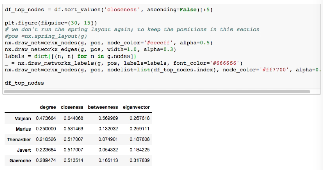  
     
   Sort by closeness.

### Structure degree

  ```
  g.degree
  ```

  

  ```
  pd.Series(dict(g.degree())).hist(bins=20)
  ```

  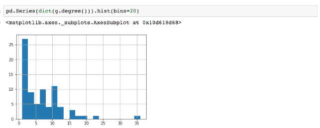  
  `dict(g.degree())` and then `Series`. Then Draw a picture.

* Heave tail distribution, which is famous for rich will be richer and poor will be poorer.

### Clustering coefficient

  ```
  nx.algorithms.clustering(g,['XXX','XXX','XXX'])
  nx.average_clustering(g)
  ```

  The numbers of triangles over the number of potential triangles .
  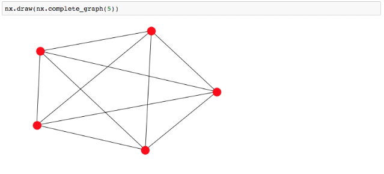
  ```
  nx.average_clustering(nx.complete_graph(5))
  ```

  

### Cliques part of the graph

  ```
  Cliques=list(nx.find_cliques(g))
  ```

  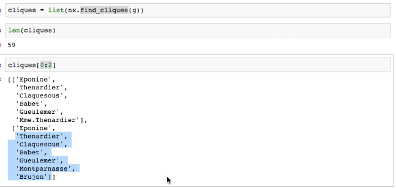

  ```
  from matplotlib import pyplot as plt
  plt.figure(figsize=(20,20))
  pos=nx.spring_layout(g)
  nx.draw_networkx_nodes(g,
                     pos,
                     node_color='#ccccff',
                     alpha=0.5
                     )
  nx.draw_networkx_edges(g,
                     pos,
                     width=1,
                     alpha=0.3
                     )
  labels=dict([(n,n)for n in g.nodes])
  _=nx.draw_networkx_labels(g,
                   pos,
                   labels=labels,
                   font_color='#666666'
                   )
  ```

  The above is the basic graph. Then

  ```
  nx.draw_networkx_nodes(g,
                       pos,
                       nodelist=cliques[1],
                       node_color='#ff7700',
                       alpha=0.5
                       )
  ```

  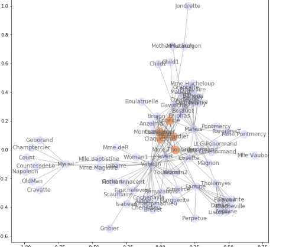

### Connected components

  ```
  components =list(nx.connected_components(g))
  ```

  to find those who are not connected by others.

### Community detection

  ```
  from networkx.algorithms import community
  communities = list(community.girvan_newman(g))
  ```

  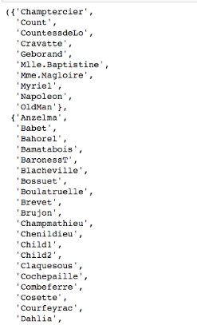  
  Those in the community is much denser,and those between the community is sparser.

  ```
  communities = list(community.label_propagation_communities(g))
  ```

  The function is similar.

### Color the nodes

```
plt.figure(figsize=(20,20))
pos=nx.spring_layout(g)
nx.draw_networkx_edges(g,pos,width=1,alpha=0.3)

for i in range(0, len(communities)):
  nodelist=communities[i]
  print(nodelist)
  nx.draw_networkx_nodes(g,pos,nodelist=nodelist,node_color=color(i), alpha=0.8)
  labels=dict([(n, '%s:%s' % (n, g.nodes[n]['group'])) for n in nodelist])
  nx.draw_networkx_labels(g,pos,labels=labels,fint_color='#666666')
```

  
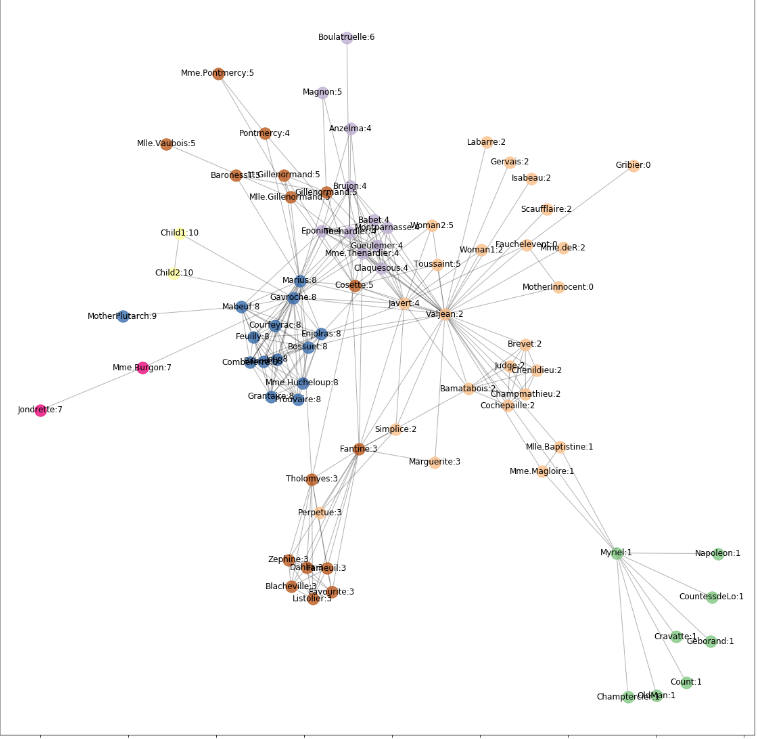

------

If you have any questions, or seek for help troubleshooting, please [create an issue here](https://github.com/hupili/python-for-data-and-media-communication-gitbook/issues/new)
